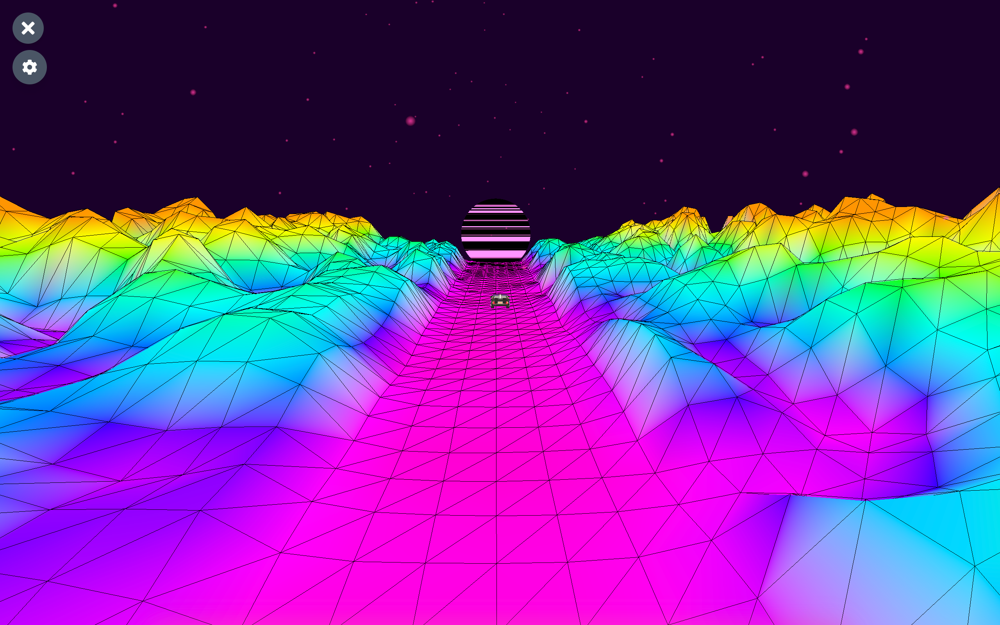
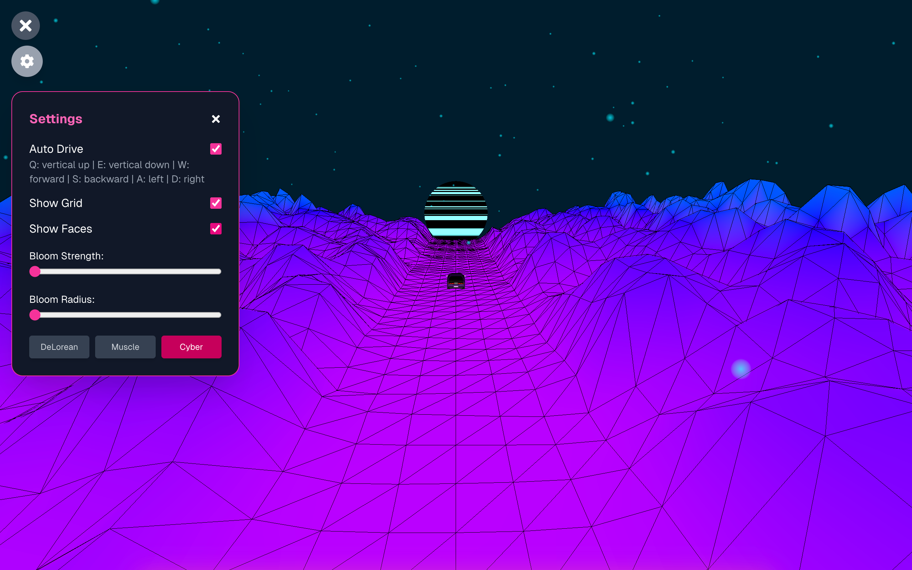
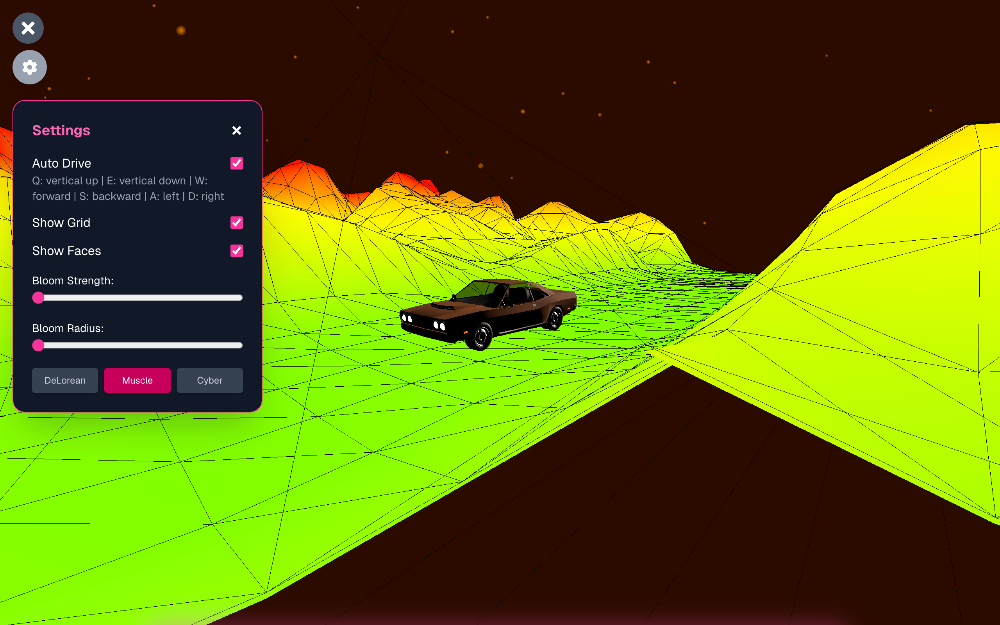

# Synthwave Music Visualizer

An interactive, browser-based music visualizer built with **Three.js**, **React**, and the **Web Audio API**, designed to capture the nostalgic energy of synthwave. Upload your favorite track and watch the scene come alive with neon terrain, retro-futuristic cars, and pulsing visuals—all synced in real time to your music.

**Live Demo**: [synthwave-rosy.vercel.app](https://synthwave-rosy.vercel.app/)

## Features

- Real-time audio analysis with Web Audio API
- Reactive terrain, lighting, and environment based on music
- Switchable car themes: DeLorean, Muscle, and Cyber
- Shader-powered synthwave sun and animated particles
- Post-processing bloom and camera tracking
- Minimal music player with playback controls and auto-hide UI

## Themes & Background Colors

Each theme sets its own unique synthwave tone:

- **DeLorean** – Purple Twilight: `#1a002a`
- **Muscle** – Sunset Orange: `#2b0a00`
- **Cyber** – Deep Blue: `#001d2d`

## Tech Stack

- [Three.js](https://threejs.org/docs/) – 3D rendering
- [React](https://reactjs.org/) + [Next.js](https://nextjs.org/) – Web framework
- [Web Audio API](https://developer.mozilla.org/en-US/docs/Web/API/Web_Audio_API) – Real-time audio analysis
- GLSL Shaders – Custom visual effects
- Tailwind CSS – Styling

## Setup

```bash
# Clone the repo
git clone https://github.com/your-username/synthwave-visualizer.git
cd synthwave-visualizer

# Install dependencies
npm install

# Start the development server
npm run dev
```


## Folder Structure

```
/public         # Static assets (models, audio, images)
\components     # React UI components
\lib            # Utility functions
\shaders        # GLSL shader files
\pages          # Next.js routing
\styles         # Tailwind CSS config
```

## Screenshots





## Credits

3D Models from [Sketchfab](https://sketchfab.com/):  
- DeLorean by JellyFighter  
- Dodge Challenger by SDC PERFORMANCE  
- Classic Muscle Car by Lexyc16  